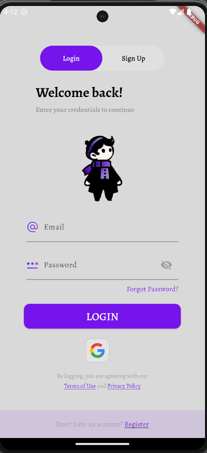
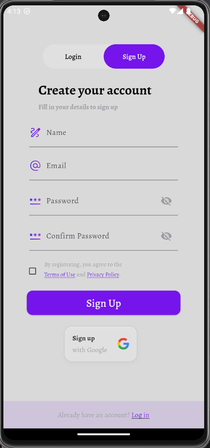
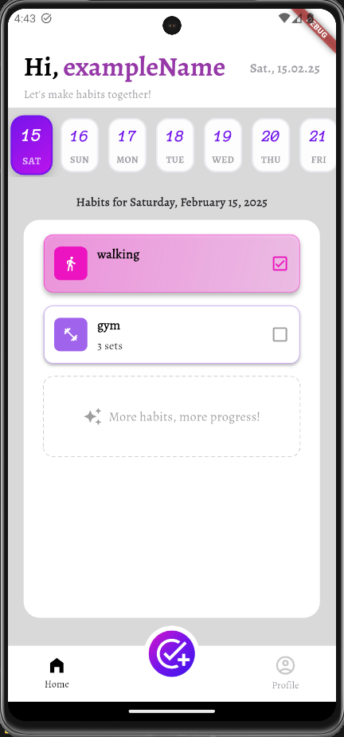
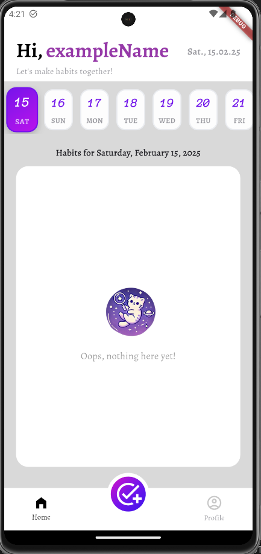
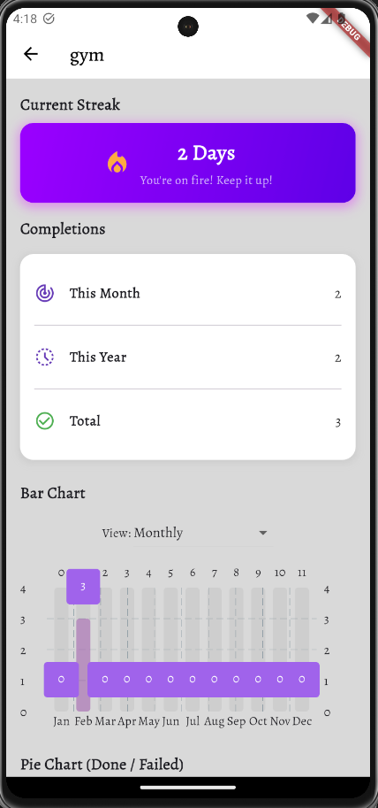

# Smart Habit Tracker

## Project Description

**Smart Habit Tracker** is a mobile application built with Flutter that helps users create and maintain positive habits. With its intuitive user interface and advanced features, the app enables you to track progress, set reminders (be added in the future), and analyze habit statistics to achieve your personal goals.

[Figma](https://www.figma.com/design/FaGwjBrR63uEE1yxaH2D4A/smart-habit-tracker?node-id=2-21086&p=f)

## Screenshots

Here are some screenshots of the app:

<details>
<summary>Login / Register screens</summary>




</details>

<details>
<summary>📌 Home Screen</summary>




</details>

<details>
<summary>📊 Habit Statistics</summary>



</details>

## Features

-  **Create & Edit Habits:** Easily add new habits or modify existing ones with customizable details.
-  **Scheduling:** Set habit frequency (daily, specific days of the week, etc.) and create personalized schedules.
-  **Reminders (be added in the future):** Enable notifications to remind you to complete your habits.
-  **Statistics & Charts:** Monitor your progress with detailed statistics and graphical representations.
-  **Widgets:** Add habit widgets to your home screen for quick access and real-time tracking.

## Installation

To run the project locally, follow these steps:

1. **Clone the Repository:**
```git clone https://github.com/ejaszczuq/smart-habit-tracker.git```
```cd smart-habit-tracker```

2. **Install Dependencies: Ensure you have Flutter (version 2.0.0 or higher) installed. Then run:**
   ```flutter pub get```

3. **Run the App: Connect your device or start an emulator, then run:**
   ```flutter run```

## Requirements

-  Flutter SDK: Version 2.0.0 or higher
-  Dart: Version 2.12.0 or higher

## License

### This project is licensed under the **MIT License**.

## Authors

-  [ejaszczuq](https://github.com/ejaszczuq)
-  [M-44ks](https://github.com/M-44ks)
